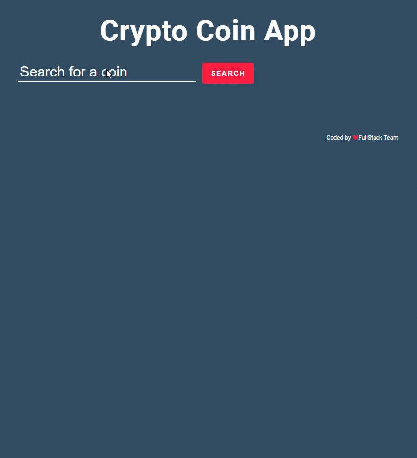

<p></p>

# Crypto-Coin-App (JS)

## Description
Project aims to display current data of searched crypto coin around the world with fetching Crypto Coin Api data.

## Learning Outcomes

At the end of the this project, students will be able to;

- analyze a problem, create a crypto coin app populated with a real crypto coin api.

- demonstrate their knowledge of algorithmic design principles.

   
## Problem Statement

- Design a crypto coin page following the design and populate data for searched crypto coin with using of axios in JS.

## Project Skeleton 

```
005- Crypto-Coin-App (folder)
|
|----readme.md         # Given to the students (Definition of the project)          
|----solution
        |----index.html  
        |----css/style.css   
        |----crypto.js
        |----js
              |----aes.js
              |----Extentions.js
```


## Outcome


User stories;

  - User can search crypto coin around the world crypto coin market.
  - The app can fetch api with the searched crypto coin name(... and apikey if it is obligatory).
  - User can display data of searched crypto coin in coin data card.
  - User can display list of searched crypto coin data card like on gif.
  - If new searched crypto coin is in the crypto card list, app can display a warning text to user on page.

🔥[Coinranking Api](https://developers.coinranking.com/api/documentation) for your app. 

🔥[Crypto-Coin-App](https://github.com/clarusway/clarusway-full-stack-tr-14/tree/main/javascript/projects/004-Crypto-Coin-App) 